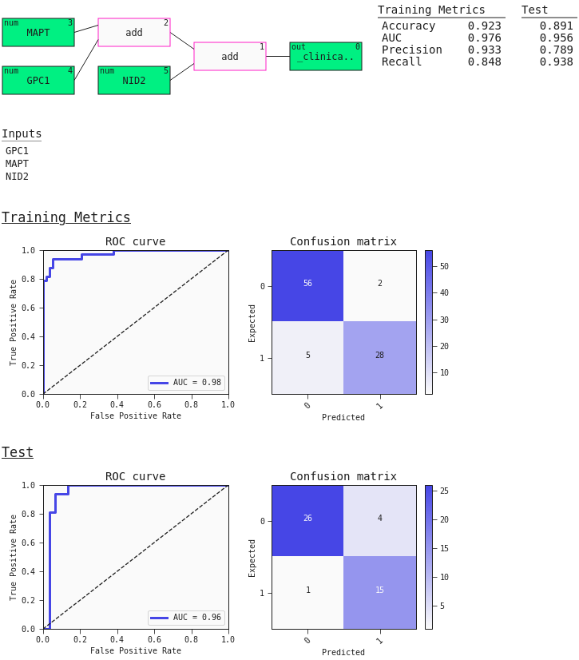
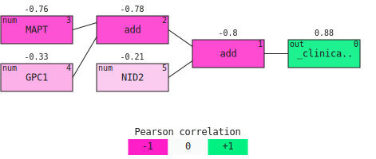
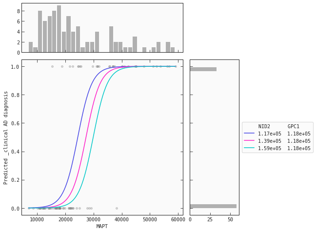

# QLattice Clinical Omics paper

Reproducible analysis and data for "Identifying molecular interactions in omics data for clinical biomarker discovery"
paper

## Reproduce results

### Create environment
We recommend using Virtualenv to create an environment.
We use python 3.8.

From a terminal in the root folder:

```
virtualenv venv -p 3.8
source venv/bin/activate
pip install -r requirements.txt
```

### Run notebooks

Under the folder notebooks there is a folder for each one of the four cases discussed in the paper.
All models, performance metrics, and figures can be reproduced by running the notebooks.


## QLattice tutorial

Below is a basic tutorial on how to use the QLattice to find models that relate the input variables of a dataset to its output variable. Its Jupyter notebook can be found in the `notebooks` folder of this repository. Other tutorials can be found in the [Feyn+QLattice documentation page](https://docs.abzu.ai/docs/tutorials/python/covid_mrna.html).

---
Finding AD biomarkers in proteomics data
---
<div style='visibility:hidden' id='notebook-meta' data-filetype='.csv' data-notebook='.ipynb'></div>

by: [Samuel Demharter and Meera Machado](https://www.abzu.ai/team)

Feyn version: 2.1+

Last updated: 23/09/2021

Can the QLattice deal with omics data that is noisy and contains thousands of features? It certainly can!

Omics data typically contains hundreds to thousands of features (proteins, transcripts, methylated DNA etc.) that are measured in samples derived from sources such as blood, tissue or cell culture. These types of approaches are often used for exploratory analysis e.g. in **biomarker discovery** or understanding the **mechanism of action** of a certain drug. It often resembles a bit of a "fishing exercise".

Thus, there is a need to quickly and reliably identify the most important **features** and their **interactions** that contribute to a certain signal (e.g. disease state, cell-type identity, cancer detection).

In this tutorial we present a brief workflow for building simple and interpretable models for proteomics data. This specific example is taken from a study by [Bader & Geyer et al. 2020](https://www.embopress.org/doi/full/10.15252/msb.20199356) (Mann group) and contains samples taken from the cerebrospinal fluid of Alzheimer Disease (AD) patients and non-AD patients. We will show you how to build `QLattice` model that can classify people into AD and non-AD according to their proteomic profiles.

The dataset contains over a thousand features (features in this example describe the intensity of different proteins measured by mass spectrometry).


```python
import numpy as np
import pandas as pd
import feyn

from sklearn.model_selection import train_test_split
import matplotlib.pyplot as plt
```

## Load the data
Note, the data has been preprocessed and missing values have been imputed.
It contains **1166 proteins** and **88 non-AD** and **49 AD** subjects.


```python
data = pd.read_csv("../data/ad_omics.csv")

# Let's record the categorical data types in our dataset (note features will be treated as numerical by default).
stypes = {}
for f in data.columns:
    if data[f].dtype =='object':
        stypes[f] = 'c'
```

## Split dataset into train and test set


```python
# Set random seed for reproducibility
random_seed = 42

# Define the target variable
target = "_clinical AD diagnosis"

# Split
train, test = train_test_split(data, test_size=0.33, stratify=data[target], random_state=random_seed)
```

## Train the QLattice

### Sample and fit models

This occurs in the following steps:

1. Sample models from the QLattice;
2. Fit the models by minimizing [BIC (Bayesian Information Criterion)](https://en.wikipedia.org/wiki/Bayesian_information_criterion);
3. Update the QLattice with the best models' structures;
4. Repeat the process;

This is all captured within the `auto_run` function


```python
# Connecting
ql = feyn.connect_qlattice()

# Reset and set random seed
ql.reset(random_seed=random_seed)

# Sample and fit models
models = ql.auto_run(
    data=train,
    output_name=target,
    kind='classification',
    stypes=stypes,
    n_epochs=20
    )
```


## Inspect the top model


```python
best = models[0]
best.plot(train, test)
```



With the plot below, we inspect the *Pearson correlation* between the values at each node and the true output:


```python
best.plot_signal(train)
```





As expected, `MAPT` (i.e. Tau) seems to be driving most of the signal here. Let's investigate further.

## Explore features

Let's look at how the different features play together.


```python
show_quantiles = 'NID2'
fixed = {}
fixed[show_quantiles] = [
    train[show_quantiles].quantile(q=0.25),
    train[show_quantiles].quantile(q=0.5),
    train[show_quantiles].quantile(q=0.75)
]

best.plot_response_1d(train, by = "MAPT", input_constraints=fixed)
```





This response plot shows you how higher `NID2` levels shift the `MAPT` curve to the left. I.e. the higher your `NID2` levels, the lower your `MAPT` levels have to be for a positive AD prediction.
